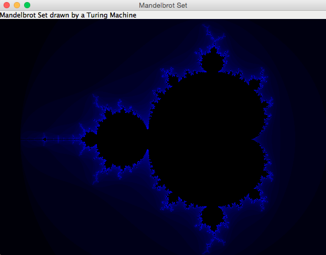
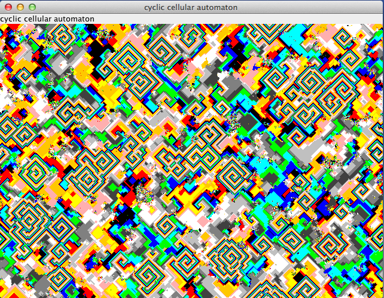

# Computer Kurzweil

## Mandelbrot

**[Computing the Edge of the Mandelbrot Set with a Turing Machine](mandelbrot/README.md)**

### The Mandelbrot Set

The Mandelbrot set is the set of values of c in the complex plane for which the orbit of 0 
under iteration of the complex quadratic polynomial z_(n+1)=z_n^2+c remains bounded.

That is, a complex number c is part of the Mandelbrot set if, when starting with z0 = 0 
and applying the iteration repeatedly, the absolute value of zn remains bounded 
however large n gets. 

### The Turing Machine to Compute the Mandelbrot Set
The Complex Number Plane is divided into Cells for the two dimensional Tape of the Turing-Machine.
Starting with Complex Number of a Cell right from the Mandelbrot Set the Turing Machine goes one Step to the left and computes, wether the Complex Number of the Cell is inside the Set. If not, it continues to go left.
The Turing-Machine then goes around the Set by computing wether the Complex Number of the Cell is inside the Set. If not it turns left, else it turns right. After that it goes one step forward.
After the Turing Machine finished to run around the Set, the Application paints the Inside of the Set Black und computes the Colors of the Outside.

### The Julia Sets
The Mandelbrot Set is drawn into the Complex Number Plane and so clicking into it, it delivers the Complex Number to calculate a Julia Set for it.
The most beautiful Julia Sets are drawn by clicking into the Border of the Mandelbrot Set.

## Simulated Evolution

**[Artificial Life Simulation of Bacteria Motion depending on DNA](simulated-evolution/README.md)**

Green food appears in a world with red moving cells. These cells eat the food if it is on their position.
Movement of the cells depends on random and their DNA. A fit cell moves around and eats enough to reproduce.
Reproduction is done by splitting the cell and randomly changing the DNA of the two new Cells.
If a cell doesn't eat enough, it will first stand still and after a while it dies.

## Diffusion-limited aggregation (DLA) 

**[Fractals and random walk due to Brownian motion cluster](diffusion-limited-aggregation/README.md)**

Diffusion-limited aggregation (DLA) is the process whereby particles undergoing a random walk due to Brownian motion cluster together to form aggregates of such particles.

This theory, proposed by T.A. Witten Jr. (not to be confused with Edward Witten) and L.M. Sander in 1981,[1] is applicable to aggregation
in any system where diffusion is the primary means of transport in the system. DLA can be observed in many systems such as electrodeposition,
Hele-Shaw flow, mineral deposits, and dielectric breakdown.

The clusters formed in DLA processes are referred to as Brownian trees. These clusters are an example of a fractal.

## Cyclic Cellular Automaton

**[More Info...](cyclic-cellular-automaton/README.md)**

The cyclic cellular automaton is a cellular automaton rule developed by David Griffeath and studied by several other cellular automaton researchers.

In this system, each cell remains unchanged until some neighboring cell has a modular value exactly one unit larger than that of the cell itself, at which point it copies its neighbor's value.

One-dimensional cyclic cellular automata can be interpreted as systems of interacting particles, while cyclic cellular automata in higher dimensions exhibit complex spiraling behavior.

## Koch Snowflake
**[More Info...](koch-snowflake/README.md)**

## Same Game
**[More Info...](samegame/README.md)**

## Sierpinski Triangle
**[More Info...](sierpinski-triangle/README.md)**

## Tetris
**[More Info...](tetris/README.md)**

## Turmite
**[More Info...](turmite/README.md)**

## Wa-Tor
**[More Info...](wator/README.md)**

## Documentation
**[More Info...](wator/README.md)**

