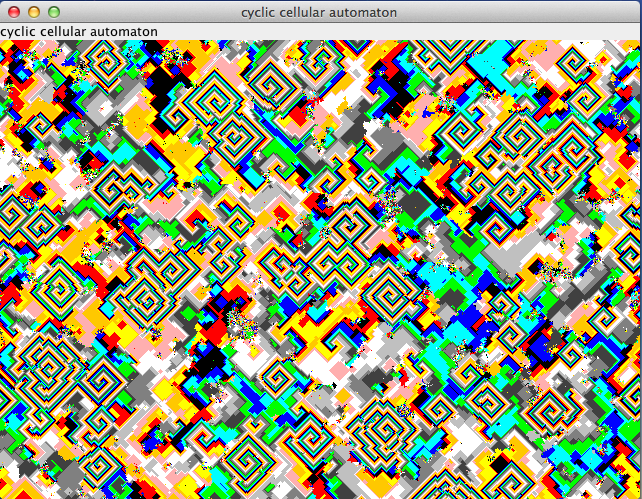

# Computer Kurzweil

## Computing the Edge of the Mandelbrot Set with a Turing Machine

The Mandelbrot set is the set of values of c in the complex plane for which the orbit of 0 
under iteration of the complex quadratic polynomial z_(n+1)=z_n^2+c remains bounded.

That is, a complex number c is part of the Mandelbrot set if, when starting with z0 = 0 
and applying the iteration repeatedly, the absolute value of zn remains bounded 
however large n gets. **[More...](etc/tabs/mandelbrot/README.md)**

## Simulated Evolution

Green food appears in a world with red moving cells. These cells eat the food if it is on their position.
Movement of the cells depends on random and their DNA. A fit cellConf moves around and eats enough to reproduce.
Reproduction is done by splitting the cellConf and randomly changing the DNA of the two new Cells.
If a cellConf doesn't eat enough, it will first stand still and after a while it dies. **[More...](etc/tabs/simulatedevolution/README.md)**

## Diffusion-limited aggregation (DLA) 

Diffusion-limited aggregation (DLA) is the process whereby particles undergoing a random walk due to Brownian motion cluster together to form aggregates of such particles.

This theory, proposed by T.A. Witten Jr. (not to be confused with Edward Witten) and L.M. Sander in 1981, is applicable to aggregation
in any system where diffusion is the primary means of transport in the system. DLA can be observed in many systems such as electrodeposition,
Hele-Shaw flow, mineral deposits, and dielectric breakdown.

The clusters formed in DLA processes are referred to as Brownian trees. These clusters are an example of a fractal. **[More...](etc/tabs/dla/README.md)**

## Cyclic Cellular Automaton (CCA)

The cyclic cellular automaton is a cellular automaton rule developed by David Griffeath and studied by several other cellular automaton researchers.

In this system, each cellConf remains unchanged until some neighboring cellConf has a modular value exactly one unit larger than that of the cellConf itself, at which point it copies its neighbor's value.

One-dimensional cyclic cellular automata can be interpreted as systems of interacting particles, while cyclic cellular automata in higher dimensions exhibit complex spiraling behavior. **[More...](etc/tabs/cca/README.md)**

## Koch Snowflake
**[More...](etc/tabs/kochsnowflake/README.md)**

## Same Game
**[More...](etc/tabs/samegame/README.md)**

## Sierpinski Triangle
**[More...](etc/tabs/sierpinskitriangle/README.md)**

## Tetris
**[More...](etc/tabs/tetris/README.md)**

## Turmite
**[More...](etc/tabs/turmite/README.md)**

## Wa-Tor
**[More...](etc/tabs/wator/README.md)**

## Goto

| Work in Progress | Github                          |
|------------------|---------------------------------|
| *[Tabs](etc/tabs/TABS.md)* | &nbsp; |
| &nbsp; | &nbsp; |
| [Projects](etc/PROJECTS.md)       | [Github-Projects](https://github.com/Computer-Kurzweil/computer_kurzweil/projects) |
| [Milestones](etc/MILESTONES.md)   | [Github-Milestones](https://github.com/Computer-Kurzweil/computer_kurzweil/milestones) |
| [Issues](etc/ISSUES.md)           | [Github-Issues](https://github.com/Computer-Kurzweil/computer_kurzweil/issues) |
| [Releases](etc/RELEASES.md)       | [Github-Releases](https://github.com/Computer-Kurzweil/computer_kurzweil/releases) |
| [Engineering](etc/ENGINEERING.md) | &nbsp; |
| &nbsp; | &nbsp; |
| *[back...](README.md)* | *[computer_kurzweil](https://github.com/Computer-Kurzweil/computer_kurzweil)* |

## Copyright
[&copy; 2020 Thomas W&ouml;hlke](etc/LICENSE.code.md)

