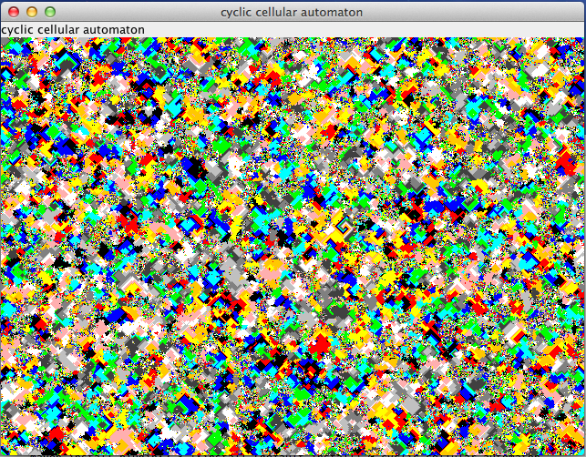
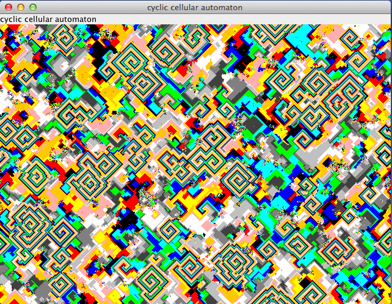

# cyclic-cellular-automaton
**Cyclic cellular automaton**

## Abstract
The cyclic cellular automaton is a cellular automaton rule developed by David Griffeath and studied by several other cellular automaton researchers.

In this system, each cell remains unchanged until some neighboring cell has a modular value exactly one unit larger than that of the cell itself, at which point it copies its neighbor's value.

One-dimensional cyclic cellular automata can be interpreted as systems of interacting particles, while cyclic cellular automata in higher dimensions exhibit complex spiraling behavior.

## Wikipedia
* [http://en.wikipedia.org/wiki/Cyclic_cellular_automaton](http://en.wikipedia.org/wiki/Cyclic_cellular_automaton)

## Screenshots

### Early Screen

### Later Screen


## Git Repository
* [https://github.com/thomaswoehlke/mandelbrot](https://github.com/thomaswoehlke/mandelbrot)
## Gradle Wrapper
* [https://docs.gradle.org/current/userguide/gradle_wrapper.html](https://docs.gradle.org/current/userguide/gradle_wrapper.html)

## Run the Desktop Application

```
git clone https://github.com/thomaswoehlke/cyclic-cellular-automaton.git
cd cyclic-cellular-automaton
./gradlew run
```

## Run the Applet Test

```
git clone https://github.com/thomaswoehlke/cyclic-cellular-automaton.git
cd cyclic-cellular-automaton
TODO: xxx
```
