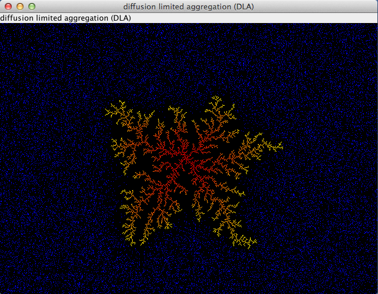

# Diffusion-limited aggregation (DLA) 

Fractals and random walk due to Brownian motion cluster

## Abstract

Diffusion-limited aggregation (DLA) is the process whereby particles undergoing a random walk due to Brownian motion cluster together to form aggregates of such particles.

This theory, proposed by T.A. Witten Jr. (not to be confused with Edward Witten) and L.M. Sander in 1981,[1] is applicable to aggregation
in any system where diffusion is the primary means of transport in the system. DLA can be observed in many systems such as electrodeposition,
Hele-Shaw flow, mineral deposits, and dielectric breakdown.

The clusters formed in DLA processes are referred to as Brownian trees. These clusters are an example of a fractal.

## Screenshots

## Wikipedia
* [https://en.wikipedia.org/wiki/Diffusion-limited_aggregation](https://en.wikipedia.org/wiki/Diffusion-limited_aggregation)

