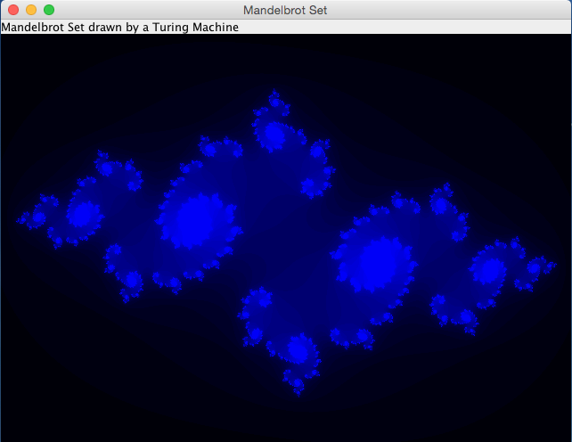
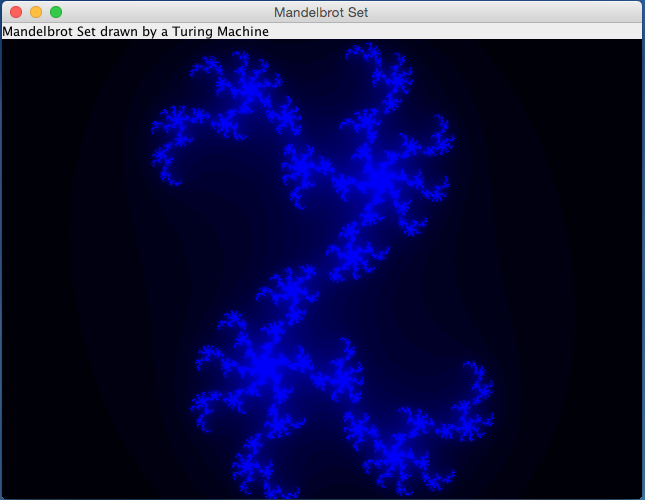

# Mandelbrot

**Computing the Edge of the Mandelbrot Set with a Turing Machine**

## Abstract: Mandelbrot Set

The Mandelbrot set is the set of values of c in the complex plane for which the orbit of 0 
under iteration of the complex quadratic polynomial z_(n+1)=z_n^2+c remains bounded.

That is, a complex number c is part of the Mandelbrot set if, when starting with z0 = 0 
and applying the iteration repeatedly, the absolute value of zn remains bounded 
however large n gets. 

## The Turing Machine to Compute the Mandelbrot Set
The Complex Number Plane is divided into Cells for the two dimensional Tape of the Turing-Machine.
Starting with Complex Number of Cell right from the Mandelbrot Set the Turing Machine goes one Step to the left and computes, wether the Complex Number of the Cell is inside the Set. If not, it continues to go left.
The Turing-Machine then goes around the Set by computing wether the Complex Number of the Cell is inside the Set. If not it turns left, else it turns right. After that it goes one step forward.
After the Turing Machine finished to run around the Set, the Application paints the Inside of the Set Black und computes the Colors of the Outside.

## Julia Set
The Mandelbrot Set is drawn into the Complex Number Plane and so clicking into it, it delivers the Complex Number to calculate a Julia Set for it.
The most beautiful Julia Sets are drawn by clicking into the Border of the Mandelbrot Set.

## More
* [https://en.wikipedia.org/wiki/Mandelbrot_set](https://en.wikipedia.org/wiki/Mandelbrot_set)
* [https://en.wikipedia.org/wiki/Julia_set](https://en.wikipedia.org/wiki/Julia_set)
* [https://en.wikipedia.org/wiki/Turing_machine](https://en.wikipedia.org/wiki/Turing_machine)

## Screenshots

### Running around the Edge of the Mandelbrot Set


### Computing the Area outside the Mandelbrot Set


### Clicked somewhere on the Edge of Mandelbrot Set: The Julia Set






### Git Repository
* [https://github.com/thomaswoehlke/mandelbrot](https://github.com/thomaswoehlke/mandelbrot.git)


### Gradle Wrapper
* [https://docs.gradle.org/current/userguide/gradle_wrapper.html](https://docs.gradle.org/current/userguide/gradle_wrapper.html) 

### Run the Desktop Application
```
git clone https://github.com/thomaswoehlke/mandelbrot.git
cd mandelbrot
./gradlew run
```

### Run the Applet Test
```
git clone https://github.com/thomaswoehlke/mandelbrot.git
cd mandelbrot
TODO: xxx
```

