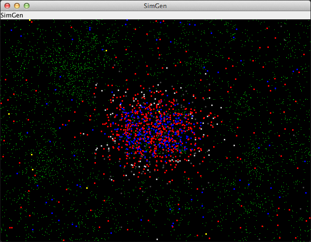

# Simulated Evolution

**Artificial Life Simulation of Bacteria Motion depending on DNA**

## Abstract

Green food appears in a world with red moving cells. These cells eat the food if it is on their position.
Movement of the cells depends on random and their DNA. A fit cellConf moves around and eats enough to reproduce.
Reproduction is done by splitting the cellConf and randomly changing the DNA of the two new Cells.
If a cellConf doesn't eat enough, it will first stand still and after a while it dies.

## Blog Article 
* [http://thomas-woehlke.blogspot.de/2016/01/simulated-evolution-artificial-life-and.html](http://thomas-woehlke.blogspot.de/2016/01/simulated-evolution-artificial-life-and.html)

## Screenshots

### Early Screen 


### Later Screen 



### Explanation

| Color | Explanation |
|-------|-------------|
|  | water           |
|  | food            |
|  | cellConf is young   |
|   | cellConf is fat enough to reproduce*   |
|   | cellConf is old enough to reproduce*   |
|   | cellConf is hungry and waiting for food or death   |
|   | cellConf is old and waiting for death   |
| &nbsp; | * (if cellConf is fat and old enough for reproduction it splits and changes the childrens DNA)   |


## UML Class Model


## Git Repository
* [https://github.com/thomaswoehlke/simulated-evolution](https://github.com/thomaswoehlke/simulated-evolution)

## Run the Desktop Application
```
git clone https://github.com/thomaswoehlke/simulated-evolution.git
cd simulated-evolution
./gradlw run
```

## Run the Applet Test
```
git clone https://github.com/thomaswoehlke/simulated-evolution.git
cd simulated-evolution
TODO: xxx
```


