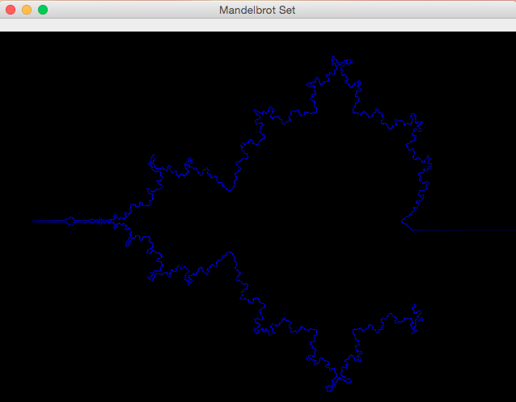
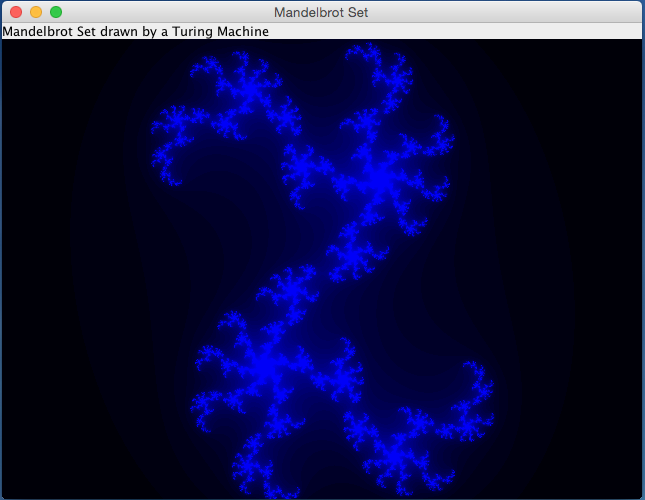

# Wator

**Wator Slogan**

## Abstract: Wator


## More
* [https://en.wikipedia.org/wiki/Mandelbrot_set](https://en.wikipedia.org/wiki/Mandelbrot_set)
* [https://en.wikipedia.org/wiki/Julia_set](https://en.wikipedia.org/wiki/Julia_set)
* [https://en.wikipedia.org/wiki/Turing_machine](https://en.wikipedia.org/wiki/Turing_machine)

## Screenshots

### Running around the Edge of the Mandelbrot Set


### Running around the Edge of the Mandelbrot Set



### Computing the Area outside the Mandelbrot Set


### Clicked somewhere on the Edge of Mandelbrot Set: The Julia Set


### Clicked  on another Point on the Edge of Mandelbrot Set: The Julia Set




### Git Repository
* [https://github.com/thomaswoehlke/mandelbrot](https://github.com/thomaswoehlke/mandelbrot.git)


### Gradle Wrapper
* [https://docs.gradle.org/current/userguide/gradle_wrapper.html](https://docs.gradle.org/current/userguide/gradle_wrapper.html) 

### Run the Desktop Application
```
git clone https://github.com/thomaswoehlke/mandelbrot.git
cd mandelbrot
./gradlew clean shadowJar runShadow
```

### Run the Applet Test
```
git clone https://github.com/thomaswoehlke/mandelbrot.git
cd mandelbrot
TODO: xxx
```

